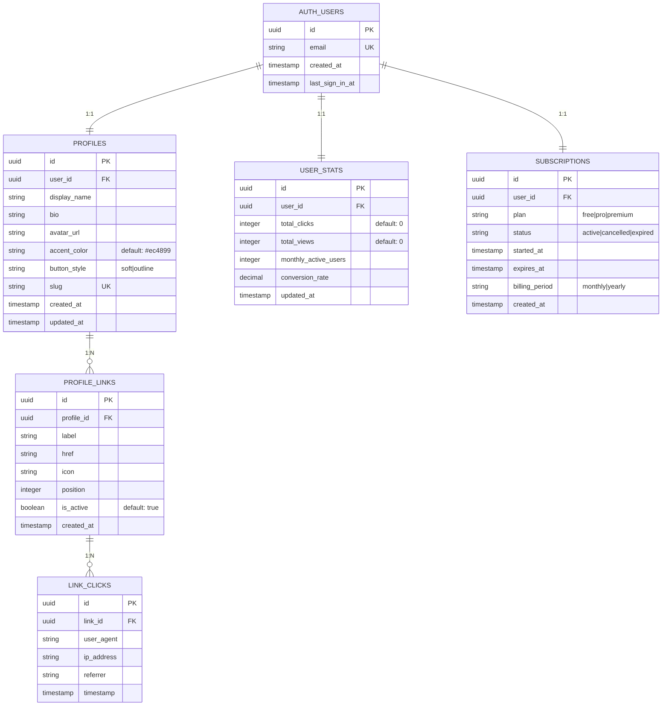

# 📊 Diagrama ER - Base de Datos LINKBIO

## Diagrama Entidad-Relación Completo



---

## Jerarquía de Datos

```
┌─────────────────────────────────────────────────────────┐
│                    auth.users                           │
│  (Gestionado por Supabase Auth)                         │
│  • id (UUID) - PK                                       │
│  • email - UNIQUE                                       │
│  • created_at, last_sign_in_at                          │
└──────────────────┬──────────────────────────────────────┘
                   │
        ┌──────────┼──────────┬──────────────┐
        │          │          │              │
        ▼          ▼          ▼              ▼
    ┌────────┐ ┌──────────┐ ┌────────────────────┐
    │profiles│ │user_stats│ │subscriptions       │
    │        │ │          │ │                    │
    │ 1:1    │ │  1:1     │ │      1:1           │
    └────┬───┘ └──────────┘ └────────────────────┘
         │
         │ 1:N
         │
         ▼
    ┌──────────────────┐
    │ profile_links    │
    │                  │
    │ • id (PK)        │
    │ • profile_id (FK)│
    │ • label          │
    │ • href           │
    │ • icon           │
    │ • position       │
    └────┬─────────────┘
         │
         │ 1:N
         │
         ▼
    ┌──────────────┐
    │ link_clicks  │
    │              │
    │ • id (PK)    │
    │ • link_id(FK)│
    │ • timestamp  │
    └──────────────┘
```

---

## Vista de Datos Típica de un Usuario

```javascript
{
  user: {
    id: "uuid-xxx",
    email: "user@example.com"
  },
  
  profile: {
    id: "uuid-yyy",
    user_id: "uuid-xxx",
    display_name: "fckn.daybeat",
    bio: "Contenido, ritmo y vibes diarias",
    avatar_url: "/avatar.png",
    accent_color: "#ec4899",
    button_style: "soft",
    slug: "fckn-daybeat-a1b2c3d4"
  },
  
  links: [
    {
      id: "uuid-link1",
      profile_id: "uuid-yyy",
      label: "YouTube",
      href: "https://youtube.com/@user",
      icon: "youtube",
      position: 0,
      is_active: true
    },
    {
      id: "uuid-link2",
      profile_id: "uuid-yyy",
      label: "TikTok",
      href: "https://tiktok.com/@user",
      icon: "tiktok",
      position: 1,
      is_active: true
    }
  ],
  
  stats: {
    id: "uuid-stats",
    user_id: "uuid-xxx",
    total_clicks: 1250,
    total_views: 3400,
    monthly_active_users: 280,
    conversion_rate: 36.76
  },
  
  subscription: {
    id: "uuid-sub",
    user_id: "uuid-xxx",
    plan: "pro",
    status: "active",
    billing_period: "monthly",
    expires_at: "2025-10-09"
  }
}
```

---

## Flujos de Datos Principales

### 1️⃣ Flujo de Registro (Signup)

```
Usuario registra email/password
        ↓
auth.users.INSERT (Supabase Auth)
        ↓
Trigger: create_user_profile_on_signup()
        ├─→ profiles.INSERT (profile inicial)
        ├─→ user_stats.INSERT (stats vacías)
        └─→ subscriptions.INSERT (plan=free)
        ↓
Usuario listo para usar la app ✅
```

---

### 2️⃣ Flujo de Actualización de Perfil

```
Usuario edita perfil en UI
        ↓
profileConfig.ts: saveProfile()
        ↓
profiles.UPDATE (display_name, bio, avatar, etc)
        ├─→ Trigger: update_updated_at ✓
        └─→ Timestamp automático
        ↓
Perfil público actualizado ✅
```

---

### 3️⃣ Flujo de Click Analytics

```
Usuario (anónimo) abre perfil: /u/slug
        ↓
Link visible en el perfil
        ↓
Usuario hace click en enlace
        ↓
link_clicks.INSERT (user_agent, ip, referrer, timestamp)
        ↓
Trigger: track_link_click()
        ├─→ user_stats.UPDATE (total_clicks++)
        └─→ updated_at = NOW()
        ↓
Analytics actualizado ✅
```

---

### 4️⃣ Flujo de Gestión de Enlaces

```
Usuario agrega/edita/elimina enlaces
        ↓
profile_links.INSERT/UPDATE/DELETE
        ↓
Perfil se renderiza con nuevos enlaces
        ↓
Link es visible en /u/slug ✅
```

---

## Características de Seguridad

### 🔐 Row Level Security (RLS)

| Tabla | SELECT | INSERT | UPDATE | DELETE |
|-------|--------|--------|--------|--------|
| **profiles** | 🌐 Public | 👤 Owner | 👤 Owner | 👤 Owner |
| **profile_links** | 🌐 Public | 👤 Owner | 👤 Owner | 👤 Owner |
| **user_stats** | 👤 Owner | ⚙️ System | ⚙️ System | ❌ No |
| **link_clicks** | 👤 Owner | 🌐 Public | ❌ No | ❌ No |
| **subscriptions** | 👤 Owner | ⚙️ System | ⚙️ System | ❌ No |

🌐 = Público  
👤 = Solo dueño  
⚙️ = Solo funciones del sistema  
❌ = No permitido  

---

## Índices de Rendimiento

```
profiles:
├─ user_id (búsqueda por usuario)
└─ slug (búsqueda de perfil público por URL)

profile_links:
├─ profile_id (obtener links de un perfil)
└─ (profile_id, position) (ordenar links)

user_stats:
└─ user_id (obtener stats del usuario)

link_clicks:
├─ link_id (analytics por link)
├─ timestamp (últimos clicks)
└─ (link_id, timestamp) (range queries)

subscriptions:
├─ user_id (obtener sub del usuario)
├─ status (filtrar por estado)
└─ expires_at (encontrar suscripciones vencidas)
```

---

## Estadísticas Estimadas

| Entidad | Registros típicos | Crecimiento |
|---------|-------------------|------------|
| Users | 1-1000 | Lento (nuevos registros) |
| Profiles | 1:1 con users | Igual a users |
| Profile Links | 5-20 por usuario | Medio (usuarios agregan links) |
| Link Clicks | 100-1000K/mes | Rápido (analítica) |
| User Stats | 1:1 con users | Igual a users |
| Subscriptions | 1:1 con users | Igual a users |

**Recomendación:** Archive link_clicks más antiguos de 90 días para mantener performance.

